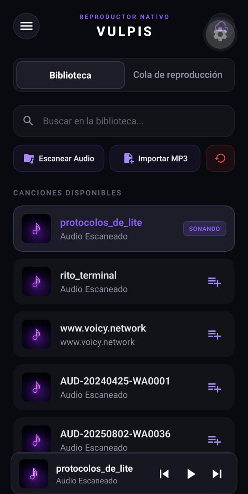
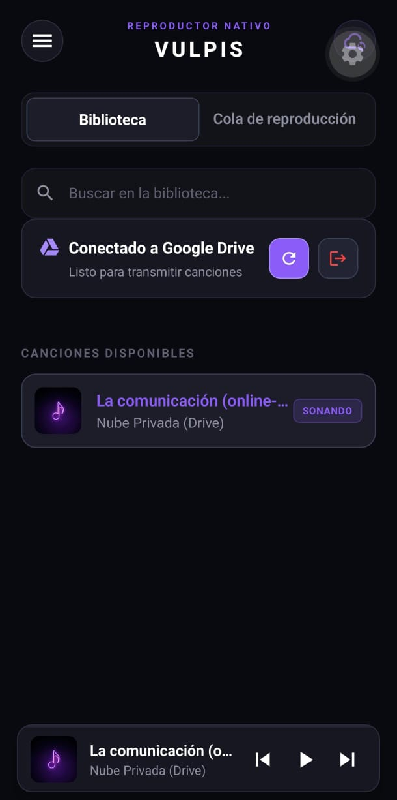
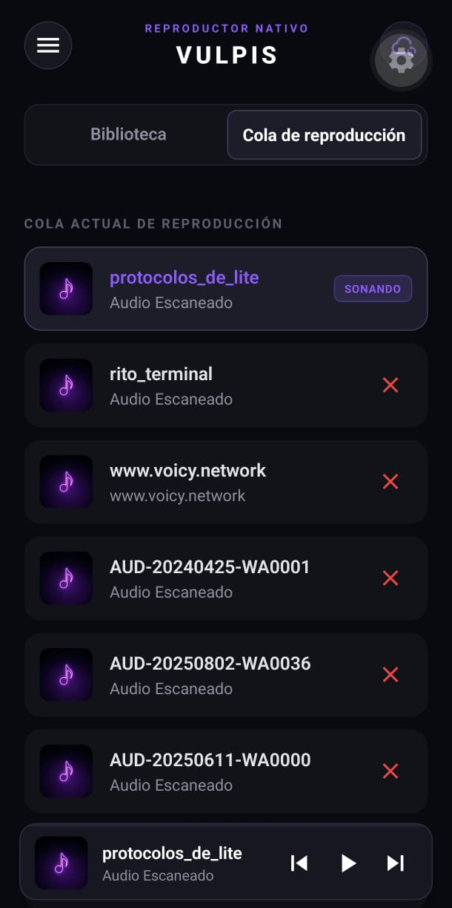
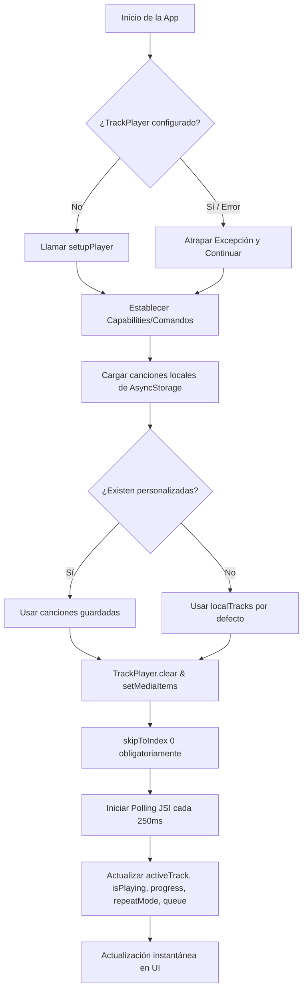
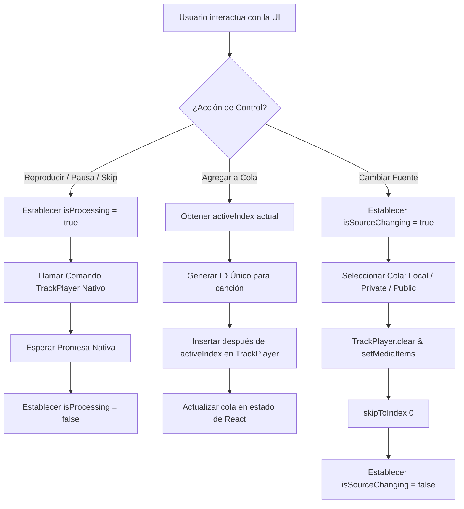
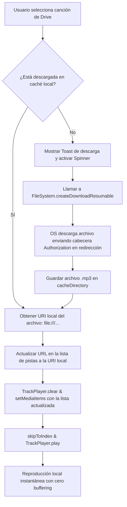

# Vulpis 🦊 - Reproductor de Audio Premium

<p align="center">
    
</p>

> Un reproductor de audio robusto para dispositivos móviles desarrollado con React Native y Expo, diseñado con soporte de reproducción en segundo plano, persistencia local y sincronización en tiempo real para una experiencia premium.

---

- **Autor: [AnthoFu🦊](https://github.com/AnthoFu)**
- **Última actualización: 5 de julio de 2026**

## 🚀 Funcionalidades

- **Múltiples Fuentes de Audio:** Cambia fácilmente entre biblioteca local, servidor privado (nube/NAS) y biblioteca pública de demostración.
- **Sincronización con Google Drive:** Conéctate de forma segura a tu cuenta de Google Drive usando OAuth 2.0 y PKCE para reproducir tu música desde la nube privada.
- **Caché Inteligente (En Demanda):** Descarga y almacena en caché local las canciones de Drive en tu dispositivo para ahorrar datos móviles y permitir reproducción sin buffering.
- **Escaneo y Búsqueda Local:** Escanea automáticamente tu dispositivo en busca de archivos `.mp3` utilizando [expo-media-library](https://docs.expo.dev/versions/unversioned/sdk/media-library/).
- **Importador de Canciones:** Selecciona e importa archivos de audio específicos desde el almacenamiento de tu teléfono mediante [expo-document-picker](https://docs.expo.dev/versions/unversioned/sdk/document-picker/).
- **Persistencia en Almacenamiento:** Tus pistas escaneadas e importadas se guardan de forma persistente utilizando [AsyncStorage](https://react-native-async-storage.github.io/async-storage/).
- **Gestión Avanzada de Cola de Reproducción:** Agrega canciones a la cola dinámica o elimínalas al instante, con estados visuales claros que indican la pista activa actual.
- **Controles de Audio Premium:** Play/Pause, canción anterior, canción siguiente, y modos de reproducción aleatoria (Shuffle) y repetición (Repeat).
- **Evitación de Condiciones de Carrera (Debouncing):** Sistema inteligente de bloqueo de interfaz (`isProcessing`) mientras el reproductor procesa comandos nativos para evitar clics accidentales.
- **Reproducción en Segundo Plano:** El audio sigue sonando incluso si bloqueas la pantalla o minimizas la aplicación gracias a los servicios en segundo plano integrados.

## 📸 Capturas de Pantalla

<table align="center">
  <tr>
    <td align="center"><strong>Biblioteca Local</strong><br></td>
    <td align="center"><strong>Biblioteca Google Drive</strong><br></td>
    <td align="center"><strong>Cola de Reproducción</strong><br></td>
  </tr>
</table>

## 🛠️ Stack de Tecnología

- **Framework:** [React Native](https://reactnative.dev/) con [Expo](https://expo.dev/) (SDK 56)
- **Lenguaje:** [JavaScript](https://developer.mozilla.org/es/docs/Web/JavaScript) (ES6+)
- **Motor de Audio:** [@rntp/player](https://github.com/react-native-track-player/react-native-track-player) (v5.6.0) basado en JSI, Fabric y TurboModules
- **Descargas y Sistema de Archivos:** [expo-file-system/legacy](https://docs.expo.dev/versions/unversioned/sdk/filesystem/) (para descargas nativas resilientes en caché y resolución de redirecciones de Google Drive)
- **Lectura de Metadatos:** [jsmediatags](https://github.com/aadsm/jsmediatags) (para extraer metadatos ID3 de archivos MP3)
- **Almacenamiento Local:** [AsyncStorage](https://react-native-async-storage.github.io/async-storage/)

## 🎵 Arquitectura de Audio

Vulpis utiliza una arquitectura de audio avanzada adaptada a la **Nueva Arquitectura** de React Native 0.85+ y Expo 56.

### 1. Inicialización Diferida e Inyección Resiliente
En [index.js](file:///home/anthofu/Escritorio/git/Vulpis/index.js), el playback service se carga de forma diferida (`require('./service').default`) para asegurar que el motor nativo del dispositivo esté listo antes de arrancar los servicios de JavaScript. 

En [App.js](file:///home/anthofu/Escritorio/git/Vulpis/App.js), la inicialización captura cualquier excepción de duplicidad (común al usar *Fast Refresh*) y aplica un `skipToIndex(0)` obligatorio para garantizar que ExoPlayer (Android) configure la pista inicial correctamente.

### 2. Sincronización mediante Polling JSI (Zero Latency)
Debido a fallos inherentes en los emisores de eventos nativos (`DeviceEventEmitter`) en Android al notificar transiciones de pista en la v5.6+, implementamos un sistema de **Polling Activo** en [App.js](file:///home/anthofu/Escritorio/git/Vulpis/App.js). 

Aprovechando que `@rntp/player` está implementado sobre JSI, las llamadas a getters como `TrackPlayer.getActiveMediaItem()` y `TrackPlayer.getProgress()` son **síncronas en C++** y tienen latencia cero. El polling consulta el motor nativo cada 250ms y actualiza el estado de React en cascada a todos los componentes hijos:
* [PlayerCard.js](file:///home/anthofu/Escritorio/git/Vulpis/src/components/PlayerCard.js) (Reproductor expandido)
* [MiniPlayer.js](file:///home/anthofu/Escritorio/git/Vulpis/src/components/MiniPlayer.js) (Mini reproductor flotante)
* [ProgressBar.js](file:///home/anthofu/Escritorio/git/Vulpis/src/components/ProgressBar.js) (Progreso de la pista)
* [QueueList.js](file:///home/anthofu/Escritorio/git/Vulpis/src/components/QueueList.js) (Lista e importaciones)

### 3. Prevención de Concurrencia (Debouncing)
Para prevenir *race conditions*, los botones de control de [Controls.js](file:///home/anthofu/Escritorio/git/Vulpis/src/components/Controls.js) and [QueueList.js](file:///home/anthofu/Escritorio/git/Vulpis/src/components/QueueList.js) se inhabilitan visualmente bajo la bandera `isProcessing` durante la ejecución de promesas de cambio de pista o reproducción.

---

## ☁️ Integración con Google Drive y Caché en Demanda

Vulpis implementa un cliente de Google Drive nativo robusto para la nube privada, solucionando limitaciones de seguridad críticas de los reproductores móviles.

### 1. Autenticación Segura (OAuth 2.0 con PKCE)
Para integrarse de manera segura con repositorios públicos y evitar credenciales estáticas ("hardcoded"):
- **Configuración Dinámica (`app.config.js`):** La app genera su esquema de URL de callback dinámicamente (`com.googleusercontent.apps.[CLIENT_ID_PREFIX]`) a partir de variables de entorno (`process.env.EXPO_PUBLIC_GOOGLE_CLIENT_ID`).
- **Flujo PKCE (Proof Key for Code Exchange):** Implementa el flujo de Código de Autorización con desafío PKCE (`plain`) para intercambiar de manera segura el código devuelto por Google por un token de acceso a nivel de aplicación nativa.

### 2. Evitación del Bloqueo por Redirección (ExoPlayer Cross-Domain Workaround)
Cuando ExoPlayer (Android) intenta reproducir archivos de Google Drive usando `https://www.googleapis.com/drive/v3/files/FILE_ID?alt=media` con la cabecera `Authorization: Bearer <token>`, el servidor de Google redirige temporalmente a un subdominio de `*.googleusercontent.com`.
Por seguridad, ExoPlayer **elimina automáticamente la cabecera de autenticación** al cambiar de dominio (`googleapis.com` -> `googleusercontent.com`), lo que causa un error `403 Forbidden` en la descarga real y congela la reproducción en bucle de `buffering`.

Para solucionarlo, Vulpis implementa un flujo de **Caché en Demanda**:
1. **Interceptor en Reproducción:** Al seleccionar un archivo de Drive, la app intercepta el evento.
2. **Descarga Nativa Segura:** Utiliza `FileSystem.createDownloadResumable` de [expo-file-system/legacy](https://docs.expo.dev/versions/unversioned/sdk/filesystem/) pasándole la cabecera de autenticación. El gestor de descargas del OS sigue la redirección y mantiene las credenciales correctas en la capa nativa para descargar el archivo `.mp3`.
3. **Caché Persistente:** Guarda el archivo localmente en `FileSystem.cacheDirectory`. Si el usuario reproduce la canción más de una vez, la app detecta el archivo local y lo reproduce instantáneamente desde la caché del dispositivo, ahorrando ancho de banda.
4. **Reproducción Local Confiable:** Se le entrega a `TrackPlayer` una URL de tipo archivo local (`file:///...`), eliminando la necesidad de streaming autenticado sobre HTTP.

---

## 🏁 Cómo Empezar

### Prerrequisitos

- [Node.js](https://nodejs.org/) (v18 o superior)
- Un cable USB y tu teléfono Android físico.

### Configuración de Variables de Entorno (Google Drive API)

Para habilitar la sincronización con Google Drive, debes crear un archivo `.env` en la raíz del proyecto (este archivo ya está configurado en `.gitignore` para evitar filtraciones de claves en repositorios públicos):

1. Crea un archivo llamado `.env` en el directorio raíz de tu proyecto.
2. Agrega la siguiente variable de entorno con tu ID de Cliente de Google:
   ```env
   EXPO_PUBLIC_GOOGLE_CLIENT_ID=tu_client_id_de_google.apps.googleusercontent.com
   ```
   > [!NOTE]
   > Para permitir flujos OAuth nativos e intercambiar tokens correctamente mediante PKCE sin requerir habilitar orígenes adicionales inseguros, te recomendamos utilizar un **identificador de tipo cliente de iOS** en la consola de Google Cloud Developer Console.

### Instalación del Proyecto

1. Clona el repositorio:
   ```bash
   git clone https://github.com/AnthoFu/Vulpis.git
   ```
2. Instala las dependencias:
   ```bash
   npm install
   ```

### Configuración del Entorno de Depuración (Linux / Android)

Para compilar y correr el reproductor nativo directamente en tu dispositivo físico, sigue estos pasos:

#### 1. Variables de Entorno en Linux (Computadora)
Asegúrate de agregar las siguientes líneas en tu archivo de terminal (ej. `~/.bashrc` o `~/.zshrc`) para apuntar al SDK y a la versión correcta de Java (**Java 21** para soporte con Gradle):

```bash
# Configuración del Android SDK
export ANDROID_HOME="$HOME/Android/Sdk"
export PATH="$PATH:$ANDROID_HOME/platform-tools:$ANDROID_HOME/emulator"
export JAVA_HOME="/usr/lib/jvm/java-21-openjdk"
```

Guarda los cambios y recarga tu terminal:
```bash
source ~/.bashrc
```

#### 2. Configuración en tu Teléfono Android
Habilita los permisos de desarrollador en tu dispositivo:
1. **Activar opciones de desarrollador:** Entra a *Ajustes* -> *Acerca del teléfono* y presiona **Número de compilación** 7 veces seguidas.
2. **Habilitar Depuración USB:** En *Opciones de desarrollador*, activa la **Depuración USB**.
3. **Instalar vía USB:** Habilita **Instalar vía USB** (obligatorio en dispositivos Xiaomi/Redmi/Realme para transferir la app desde tu PC).

#### 3. Ejecución de la App
1. Conecta tu teléfono a la computadora con el cable USB.
2. Autoriza la computadora en el aviso que aparece en tu teléfono.
3. Corre el comando en la raíz del proyecto:
   ```bash
   npx expo run:android
   ```
4. **Importante:** Mantente atento a la pantalla de tu móvil. Cuando diga `Installing...` en la terminal, pulsa **Instalar** en la ventana emergente que aparecerá en tu teléfono.

---

## 🤝 Contribuciones

¡Las contribuciones son bienvenidas! Siéntete libre de abrir un "issue" o enviar un "pull request".

## 📄 Licencia

Este proyecto está bajo la Licencia MIT. Consulta el archivo [LICENSE](LICENSE) para más detalles.

## 📊 Diagramas de Flujo

### 1. Flujo de Inicialización y Polling JSI


### 2. Flujo de Interacción y Gestión de Cola


### 3. Flujo de Descarga y Caché de Google Drive

